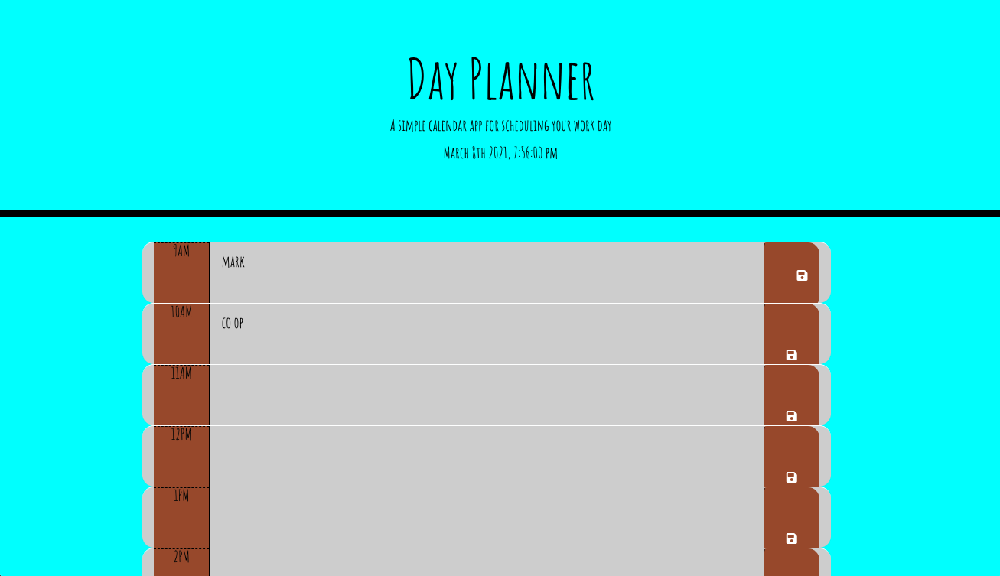
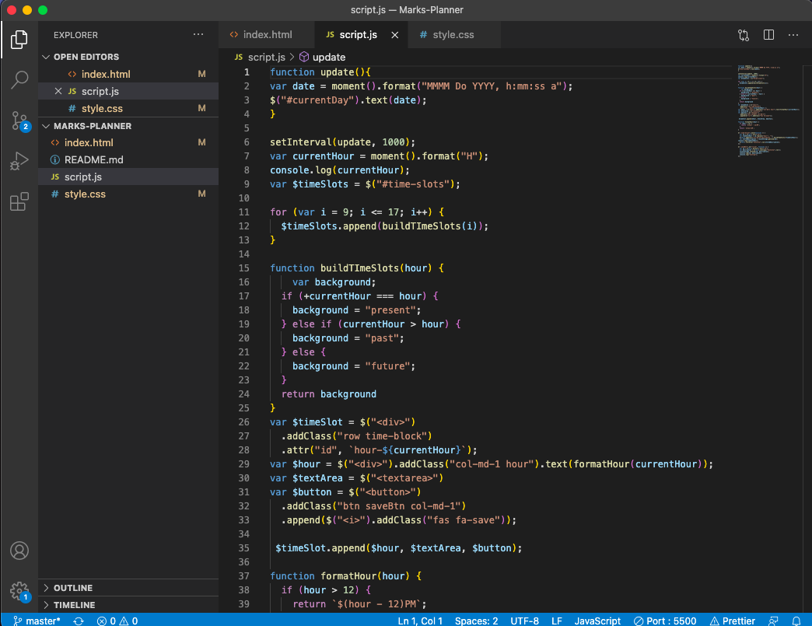

# 05 Third-Party APIs: Work Day Scheduler

## Goal
My objective was to provide you with a working day planner. While the browser is open, it should show you a typical working day. Starting at 9am and going until 5pm, you can put in things you need to accomplish throughout your day. When the time is 12pm, the row will be highlighted red so you know that it is that hour. The past hours are white, and the future hours are green. You will you be able to save all of your obligations for the day if they site refreshes. The clock is also currently and will automatically refresh.

## Usage
• Javascript
• HTML
• CSS

## Links
https://github.com/mcolumbusua21/Marks-Planner.git

## Images

